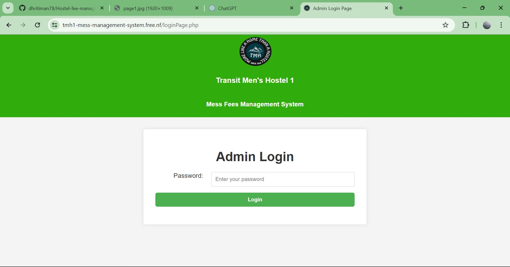
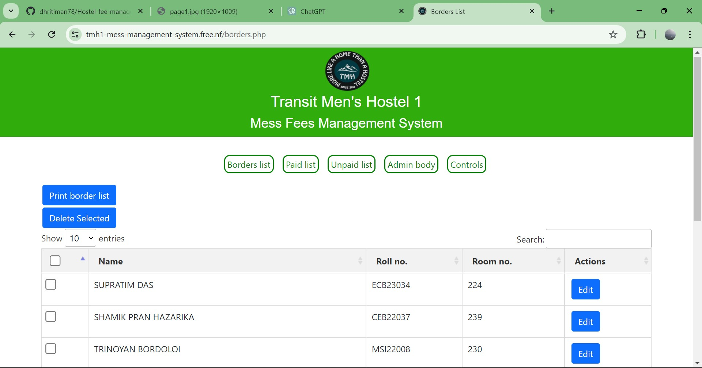
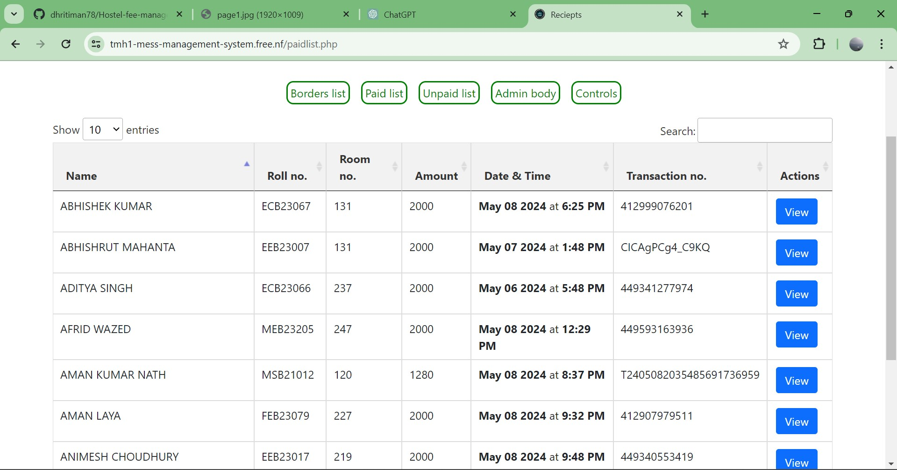
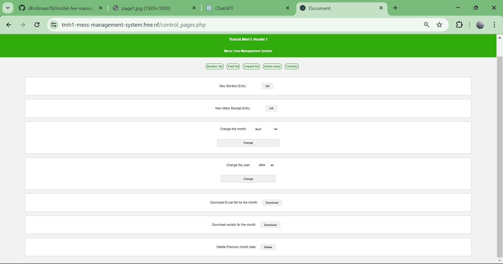
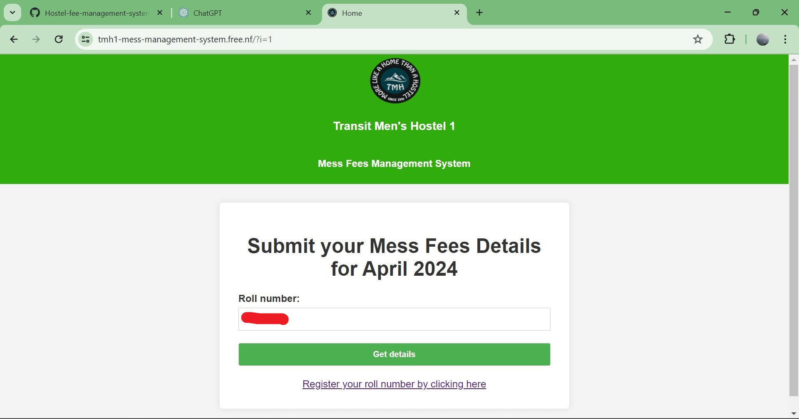
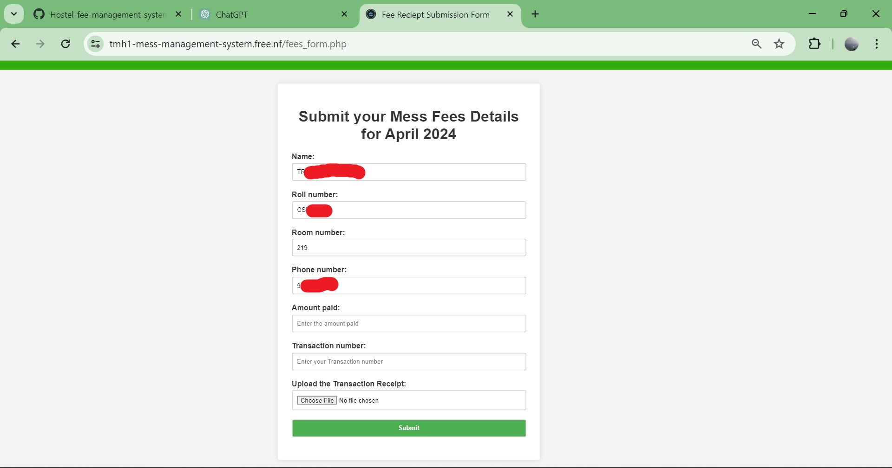
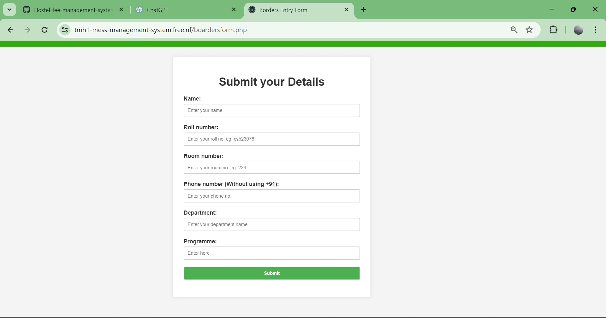

# 🏫 Hostel Fee Management System

Welcome to the Hostel Fee Management System! 🌟

This system is designed to help manage hostel fees efficiently. It simplifies the fee collection process and keeps track of hostel fee payments. The system provides a user-friendly interface for both administrators and hostel residents. 💼

## 🕰️ History

I created this project to manage the hostel fees at Transit Men's Hostel-1, Tezpur University. After successfully implementing it in my hostel, I decided to share this project with the public. 

This project is still being used in my hostel. You can view it in action by clicking [here](https://tmh1-mess-management-system.free.nf/?i=1).

## 🚀 Features

- **Admin Dashboard:** 
  - Add, update, and delete hostel residents' information. ✅
  - Manage hostel fees. 💰
  - View payment history. 📈
  
- **Resident Dashboard:**
  - View current fee status. 💳
  - Upload fees reciepts securely. 🔒
  - View payment history. 📜

## 🖼️ Screenshots

### Admin Dashboard







### Resident Dashboard





## 🛠️ Installation

To run this project locally, follow these steps:

1. Clone the repository:
   ```bash
   git clone https://github.com/dhritiman78/Hostel-fee-management-system.git

2. Install XAMPP and follow these steps:
    - Once installed, move the project directory to XAMPP's htdocs directory. This directory is usually located at C:\xampp\htdocs on Windows or /Applications/XAMPP/htdocs on macOS.
    - Start XAMPP, and make sure both Apache and MySQL are running. You can start them by clicking on the "Start" button next to each module in the XAMPP control panel.
    - Open your web browser and go to http://localhost/phpmyadmin.
    - Log in to phpMyAdmin using your username and password.
    - On the left panel, click on "New" to create a new database and name it hostel_fee_management.
    - With the hostel_fee_management database selected, click on the "Import" tab from the top menu.
    - Click on the "Choose File" button, select the req_databases.sql file you downloaded, and click "Open".
    - Finally, click on the "Go" button at the bottom to import the SQL file into the database.
    - Navigate to http://localhost/Hostel-fee-management-system in your browser.
    - Now, you can use the Hostel Fee Management System! 🎉

## 🤝 Contributing

Contributions are welcome! Please follow these steps to contribute to the project:

1. Fork the repository.
2. Create a new branch.
3. Make your changes.
4. Commit your changes.
5. Push to the branch.
6. Create a new Pull Request.
