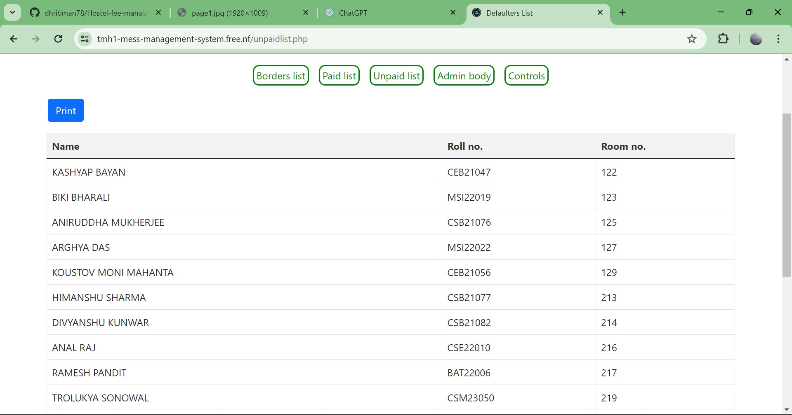

# 🏫 Hostel Fee Management System

Welcome to the Hostel Fee Management System! 🌟

This system is designed to help manage hostel fees efficiently. It simplifies the fee collection process and keeps track of hostel fee payments. The system provides a user-friendly interface for both administrators and hostel residents. 💼

## 🕰️ History

I created this project to manage the hostel fees at Transit Men's Hostel-1, Tezpur University. After successfully implementing it in my hostel, I decided to share this project with the public. 

This project is still being used in my hostel. You can view it in action by clicking [here](https://tmh1-mess-management-system.free.nf/?i=1).

## 🚀 Features

- **Admin Dashboard:** 
  - Add, update, and delete hostel residents' information. ✅
  - Manage hostel fees. 💰
  - View payment history. 📈
  
- **Resident Dashboard:**
  - View current fee status. 💳
  - Upload fees reciepts securely. 🔒
  - View payment history. 📜

## 🖼️ Screenshots

### Admin Dashboard





### Resident Dashboard


## 🛠️ Installation

To run this project locally, follow these steps:

1. Clone the repository:
   ```bash
   git clone https://github.com/dhritiman78/Hostel-fee-management-system.git

2. Install XAMPP and follow these steps:
  - Move the project directory to your XAMPP's `htdocs` directory.
  - Start XAMPP and make sure Apache and MySQL are running.
  - Open phpMyAdmin in your browser and create a new database named `hostel_fee_management`.
  - Create the required in the website (find it from the php pages) tables in the database
  - Navigate to [http://localhost/Hostel-fee-management-system](http://localhost/Hostel-fee-management-system) in your browser.
  - Now, you can use the Hostel Fee Management System!

## 🤝 Contributing

Contributions are welcome! Please follow these steps to contribute to the project:

1. Fork the repository.
2. Create a new branch.
3. Make your changes.
4. Commit your changes.
5. Push to the branch.
6. Create a new Pull Request.
